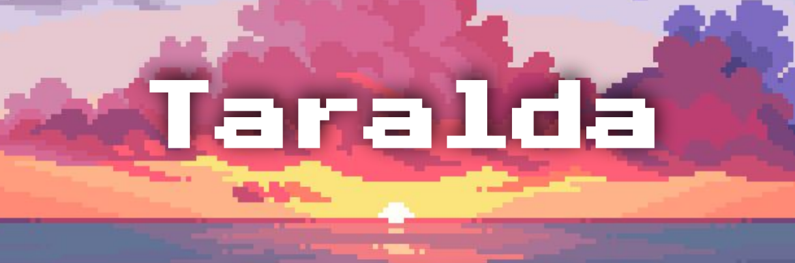
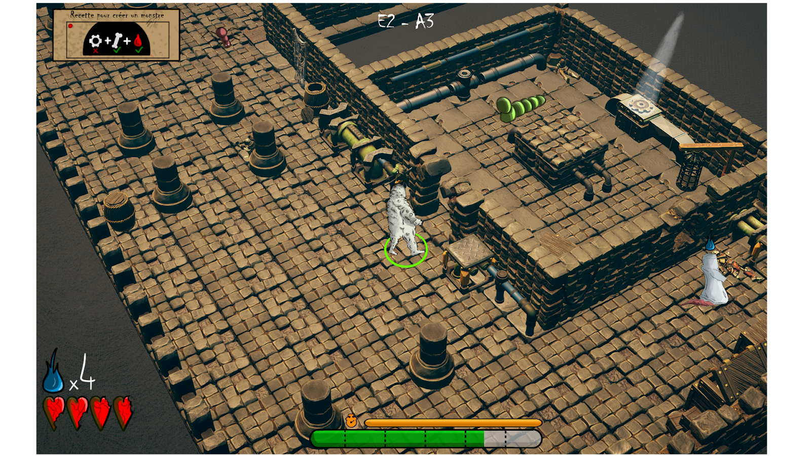

# Who am I?

## I'm Yann Chatila
I'm a video game developer specializing in **Game Design and Programming**. 

I started creating my own video games projects in **2021** alongside **Cinema and audiovisual studies** in Paris. I then embarked on a 3-year course in video games at ESMA, located in Rennes, France.

My main skills are geared towards **Game Design** and **Programmation**, which I showcase in my [main portfolio](https://github.com/Doerys/Portfolio/blob/main/README.md). But this portfolio mainly focus on game projects. Here, I focus more on **Game Designer's key documentations**, such as Game Design Documents or Game Concept Documents.

# Game Design Projects

## Taralda

> Paris 3 Sorbonne Nouvelle - Paris  
> Student Project - 2021 - 4 Months  
> Game Design Document - Team of 4  
> Lead Game Designer, Art Direction, Level Designer, Narrative Designer  

This is a semester-long project for a **Narrative Design class**, consisting in conceptualizing and documenting a **narrative game concept**.

Taralda is a **strategy game** in which the player guides a group of plane crash survivors onto an isolated island. The main goal is to leave the island, which is in the grip of a war between the tribes living there. The game incorporates narrative choice mechanisms, allowing the player to choose between different narrative directions, maintaining diplomatic or conflictual relations with the island's tribes.

This project introduced me to many elements of **Game Concept and Game Design**: Core Gameplay, Gameplay Loops, 3C, Game Mechanics, Game Feel, User Experience, Walkthrough, Game Sequences & Rhythm. Taralda taught me how to include this **information in a Game Design Document**. In addition, I was able to improve my narrative skills by thinking through all the components of the game (themes, game mechanics, art, world-building) in order to serve a narrative purpose.

### If you are interest to reach more about this project: 
- [Game Design Document (in french)](Documents/GameDesignDocument_Taralda.pdf)

## Monster Factory

> ESMA - Rennes  
> Student Project - 2023 - 1 Month  
> Game Design Class - Team of 3  
> Game Concept Document & Analysis Document

The objective of this 2nd-year student project was to identify development goals, starting with the **feelings** we wanted players to experience, in order to come up with a game concept. 

Monster Factory is an **action-adventure** game in which the player takes on the role of an undead hero trapped in a monster factory. The goal is to climb the ranks and floors of this industry by **performing your tasks in your work chain** as efficiently and quickly as possible.

This conceptualization process was heavily based on **collecting and analyzing references**, which is why there is an analytical file in addition to a Game Design Document.

### If you are interest to reach more about this project: 
- [Game Design Document & Analysis Document (in french)](Documents/GameDesignDocument_MonsterFactory.pdf)

## Paint Lovers

> ESMA - Rennes  
> Student Project - 2024 - 2 weeks  
> Game Design Class - Solo Project  
> MDA Framework & Oral Presentation

Paint Lovers is a second-year student project whose goal was to create and pitch a game concept based on an aesthetic mood board. 

Paint Lovers is a **2D puzzle platformer** in which the player, embodying a young painter, goes through four game sequences with **distinct graphic styles**, each representing the mentality of the protagonist as she progresses through the stages of life from childhood to adulthood. The core gameplay consists of **observing the environment** and identifying elements that can be **reproduced somewhere else** by reproducing them in abstract form, in order to unlock passages through the levels.

### If you are interest to reach more about this project: 
- [Oral Presentation Slides (in french)](Documents/PaintLovers_OralPresentation.pdf)

---

[Discover more projects on my Main Portfolio](https://github.com/Doerys/Portfolio/blob/main/README.md)  
[Get back to the main page](README.md)